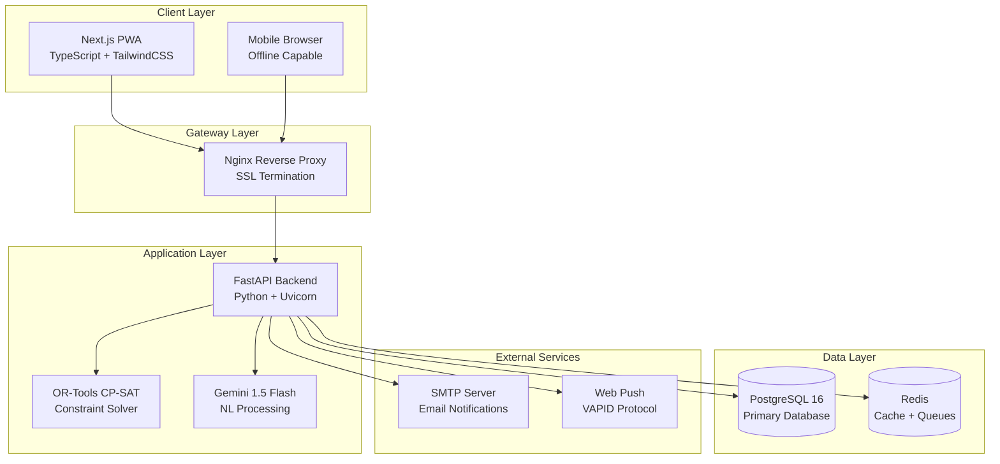

# Design Document

## Overview

Kairo is a comprehensive NEP timetable management system built with a modern, scalable architecture using free and open-source technologies. The system employs a microservices-inspired approach within a single deployable unit, leveraging AI-powered constraint solving for optimal schedule generation and natural language processing for intuitive constraint authoring.

The architecture prioritizes mobile-first design, offline capability, real-time notifications, and single-command deployment while maintaining enterprise-grade features like audit logging, what-if simulations, and automated optimization suggestions.

## Architecture

### High-Level Architecture



### Deployment Architecture

The system uses Docker Compose for single-command deployment with the following containers:

- **nginx**: Reverse proxy with SSL termination and static file serving
- **frontend**: Next.js application with server-side rendering
- **backend**: FastAPI application with OR-Tools and Gemini integration
- **postgres**: PostgreSQL 16 database with optimized indexes
- **redis**: Cache layer and message queue for background tasks

### Technology Stack Rationale

**Frontend Technologies:**
- **Next.js 14 (App Router)**: Server-side rendering, automatic code splitting, and excellent PWA support
- **TypeScript**: Type safety and better developer experience
- **TailwindCSS + shadcn/ui**: Rapid UI development with consistent design system
- **Zustand**: Lightweight state management for client-side data
- **TanStack Query**: Server state management with caching and synchronization
- **Workbox**: Service worker management for offline functionality

**Backend Technologies:**
- **FastAPI**: High-performance async API framework with automatic OpenAPI documentation
- **OR-Tools CP-SAT**: Google's constraint programming solver for optimal timetable generation
- **SQLAlchemy**: ORM with advanced query capabilities and connection pooling
- **Pydantic**: Data validation and serialization with type hints
- **Uvicorn**: ASGI server with excellent performance characteristics

**Data Technologies:**
- **PostgreSQL 16**: ACID compliance, JSONB support, and advanced indexing
- **Redis**: In-memory caching and pub/sub for real-time features

## Components and Interfaces

### Frontend Components

#### Student Portal Components
```typescript
// Core student interface components
interface StudentPortalProps {
  enrollmentNumber: string;
  viewMode: 'week' | 'day';
  offlineMode: boolean;
}

interface TimetableCard {
  courseCode: string;
  courseTitle: string;
  roomNumber: string;
  branch: string;
  facultyShortForm: string;
  courseType: 'Major' | 'Minor' | 'Lab' | 'SEC' | 'AEC' | 'VAC';
  timeSlot: TimeSlot;
}

interface TimeSlot {
  day: string;
  startTime: string;
  endTime: string;
  slotIndex: number;
}
```

#### Admin Panel Components
```typescript
// Constraint management interfaces
interface ConstraintStudio {
  formBuilder: ConstraintFormBuilder;
  geminiChatBox: GeminiChatInterface;
  testArea: ConstraintValidator;
  rulesetManager: RulesetManager;
}

interface GeminiChatInterface {
  naturalLanguageInput: string;
  structuredOutput: ConstraintJSON;
  validationResults: ValidationResult[];
  applyToRuleset: (ruleset: string) => void;
}

// Simulation and comparison interfaces
interface WhatIfSimulation {
  baseScenario: Scenario;
  modifiedScenario: Scenario;
  comparisonView: ScenarioComparison;
  promotionControls: PromotionControls;
}
```

### Backend API Interfaces

#### Core API Endpoints
```python
# FastAPI route definitions
@app.post("/api/v1/timetables/generate")
async def generate_timetable(
    scenario: ScenarioRequest,
    background_tasks: BackgroundTasks
) -> TimetableGenerationResponse

@app.post("/api/v1/constraints/natural-language")
async def process_natural_language_constraint(
    input: NaturalLanguageInput
) -> ConstraintJSON

@app.get("/api/v1/students/{enrollment_number}/timetable")
async def get_student_timetable(
    enrollment_number: str,
    week_offset: int = 0
) -> StudentTimetableResponse

@app.post("/api/v1/scenarios/{scenario_id}/simulate")
async def create_simulation(
    scenario_id: str,
    modifications: ScenarioModifications
) -> SimulationResponse
```

#### Constraint Processing Interface
```python
class ConstraintProcessor:
    def __init__(self, gemini_client: GeminiClient):
        self.gemini_client = gemini_client
        self.validator = ConstraintValidator()
    
    async def process_natural_language(
        self, 
        input_text: str, 
        context: InstitutionContext
    ) -> ConstraintJSON:
        """Convert natural language to structured constraints"""
        
    def validate_constraint(
        self, 
        constraint: ConstraintJSON, 
        existing_rules: List[ConstraintJSON]
    ) -> ValidationResult:
        """Validate constraint compatibility and syntax"""
```

### Solver Integration Interface

#### OR-Tools CP-SAT Integration
```python
class TimetableSolver:
    def __init__(self):
        self.model = cp_model.CpModel()
        self.solver = cp_model.CpSolver()
    
    def setup_variables(self, scenario: Scenario) -> SolverVariables:
        """Create decision variables for assignments"""
        
    def add_hard_constraints(self, constraints: List[HardConstraint]):
        """Add mandatory constraints that must be satisfied"""
        
    def add_soft_constraints(self, constraints: List[SoftConstraint]):
        """Add preference constraints with penalty weights"""
        
    def solve(self, time_limit_seconds: int = 300) -> SolutionResult:
        """Execute constraint solving with time limit"""
        
    def explain_assignment(
        self, 
        assignment: Assignment, 
        context: SolutionContext
    ) -> ExplanationData:
        """Generate explanation data for Gemini processing"""
```

## Data Models

### Core Entity Models

#### Student and Academic Models
```python
class Student(BaseModel):
    id: UUID
    enrollment_number: str  # Unique identifier
    name: str
    program: str  # B.Ed, M.Ed, FYUP, ITEP
    semester: int
    branch: str
    credit_cap_min: int
    credit_cap_max: int
    created_at: datetime
    updated_at: datetime

class Course(BaseModel):
    id: UUID
    code: str  # Unique course code
    title: str
    type: CourseType  # Major, Minor, SEC, AEC, VAC, Lab
    credits: int
    hours_theory: int
    hours_practical: int
    has_lab: bool
    branch: str
    prerequisites: List[str] = []

class Faculty(BaseModel):
    id: UUID
    code: str  # Unique faculty code
    name: str
    short_name: str  # For display in timetables
    department: str
    max_load: int  # Maximum teaching hours per week
    expertise_tags: List[str] = []
    availability_json: Dict[str, Any]  # Flexible availability rules
```

#### Scheduling Models
```python
class TimeSlot(BaseModel):
    id: UUID
    day: DayOfWeek
    start_time: time
    end_time: time
    slot_index: int  # For ordering within day
    duration_minutes: int

class Room(BaseModel):
    id: UUID
    code: str
    name: str
    type: RoomType  # Class, Lab, Seminar
    capacity: int
    features: List[str] = []  # Projector, Whiteboard, etc.
    building: str
    floor: int

class Assignment(BaseModel):
    id: UUID
    timetable_id: UUID
    course_id: UUID
    slot_id: UUID
    room_id: UUID
    faculty_id: UUID
    cohort_key: str  # Identifies student group
    created_at: datetime
```

#### Constraint and Optimization Models
```python
class Constraint(BaseModel):
    id: UUID
    kind: ConstraintKind  # hard, soft
    expression_json: Dict[str, Any]  # Structured constraint definition
    weight: int  # For soft constraints
    source: ConstraintSource  # ui, gemini, import
    active: bool
    note: str
    created_at: datetime

class Scenario(BaseModel):
    id: UUID
    name: str
    program: str
    semester: int
    ruleset_id: UUID
    status: ScenarioStatus  # draft, solving, ready, failed
    version: int
    objective_score: Optional[float]
    created_at: datetime
    updated_at: datetime

class Timetable(BaseModel):
    id: UUID
    scenario_id: UUID
    objective_score: float
    solve_time_seconds: int
    is_final: bool
    assignments: List[Assignment]
    created_at: datetime
```

### Audit and Tracking Models
```python
class AuditEvent(BaseModel):
    id: UUID
    actor: str  # User identifier
    action: str  # create, update, delete, generate
    entity_type: str
    entity_id: UUID
    before_json: Optional[Dict[str, Any]]
    after_json: Optional[Dict[str, Any]]
    timestamp: datetime
    ip_address: Optional[str]

class Changeset(BaseModel):
    id: UUID
    scenario_id: UUID
    actor: str
    change_type: str  # manual_edit, auto_suggestion, bulk_import
    change_json: Dict[str, Any]
    created_at: datetime
    applied: bool
```

### Database Schema Optimizations

#### Critical Indexes
```sql
-- Performance-critical indexes
CREATE INDEX idx_students_enrollment ON students(enrollment_number);
CREATE INDEX idx_assignments_timetable_slot ON assignments(timetable_id, slot_id);
CREATE INDEX idx_faculty_code ON faculty(code);
CREATE INDEX idx_faculty_short_name ON faculty(short_name);
CREATE INDEX idx_rooms_code ON rooms(code);
CREATE INDEX idx_constraints_active ON constraints(active) WHERE active = true;

-- JSONB indexes for flexible queries
CREATE INDEX idx_constraints_expression_gin ON constraints USING GIN(expression_json);
CREATE INDEX idx_faculty_availability_gin ON faculty USING GIN(availability_json);
CREATE INDEX idx_audit_events_after_gin ON audit_events USING GIN(after_json);

-- Composite indexes for common query patterns
CREATE INDEX idx_assignments_course_slot ON assignments(course_id, slot_id);
CREATE INDEX idx_enrolments_student_course ON enrolments(student_id, course_id);
CREATE INDEX idx_scenarios_program_semester ON scenarios(program, semester);
```

## Error Handling

### API Error Response Format
```python
class APIError(BaseModel):
    error_code: str
    message: str
    details: Optional[Dict[str, Any]] = None
    timestamp: datetime
    request_id: str

class ValidationError(APIError):
    field_errors: List[FieldError]

class SolverError(APIError):
    conflicting_constraints: List[str]
    suggested_modifications: List[str]
```

### Error Categories and Handling

#### Constraint Solving Errors
- **Infeasible Problem**: When hard constraints cannot be satisfied
  - Response: Identify conflicting constraints and suggest modifications
  - UI: Show constraint conflict visualization with resolution options

- **Timeout Errors**: When solver exceeds time limit
  - Response: Return best solution found so far with quality metrics
  - UI: Offer to continue solving or accept partial solution

#### Data Validation Errors
- **CSV Import Errors**: Invalid data format or missing required fields
  - Response: Detailed field-level error messages with row numbers
  - UI: Highlight problematic rows with correction suggestions

- **Constraint Validation Errors**: Invalid constraint syntax or logic
  - Response: Specific validation messages with examples
  - UI: Real-time validation feedback in constraint editor

#### External Service Errors
- **Gemini API Errors**: Rate limits or service unavailability
  - Response: Graceful fallback to structured constraint templates
  - UI: Inform user of AI unavailability with manual alternatives

- **Email/Push Notification Errors**: SMTP failures or invalid endpoints
  - Response: Queue failed notifications for retry
  - UI: Show delivery status with retry options

## Testing Strategy

### Unit Testing Approach

#### Backend Testing
```python
# Constraint solver testing
class TestTimetableSolver:
    def test_hard_constraint_enforcement(self):
        """Verify no faculty/room conflicts in generated schedules"""
        
    def test_soft_constraint_optimization(self):
        """Verify penalty minimization for preferences"""
        
    def test_infeasible_problem_detection(self):
        """Verify proper handling of unsolvable constraints"""

# API endpoint testing
class TestTimetableAPI:
    def test_student_timetable_retrieval(self):
        """Test enrollment number lookup and response format"""
        
    def test_constraint_natural_language_processing(self):
        """Test Gemini integration and JSON output validation"""
        
    def test_scenario_simulation_workflow(self):
        """Test what-if simulation creation and comparison"""
```

#### Frontend Testing
```typescript
// Component testing with React Testing Library
describe('TimetableCard', () => {
  it('displays course information correctly', () => {
    // Test course code, title, room, faculty display
  });
  
  it('applies correct color coding by course type', () => {
    // Test visual differentiation of course types
  });
  
  it('handles offline mode gracefully', () => {
    // Test cached data display when offline
  });
});

// PWA functionality testing
describe('OfflineCapability', () => {
  it('caches timetable data for offline access', () => {
    // Test service worker caching behavior
  });
  
  it('syncs changes when connection restored', () => {
    // Test background sync functionality
  });
});
```

### Integration Testing

#### End-to-End Workflows
```python
class TestCompleteWorkflows:
    def test_timetable_generation_workflow(self):
        """Test complete flow from constraint definition to schedule generation"""
        # 1. Upload institutional data
        # 2. Define constraints via UI and natural language
        # 3. Generate timetable
        # 4. Verify constraint satisfaction
        # 5. Export in multiple formats
        
    def test_what_if_simulation_workflow(self):
        """Test scenario cloning, modification, and comparison"""
        # 1. Create base scenario
        # 2. Clone and modify constraints
        # 3. Generate alternative schedule
        # 4. Compare metrics and assignments
        # 5. Promote preferred scenario
        
    def test_notification_workflow(self):
        """Test notification creation, targeting, and delivery"""
        # 1. Create schedule change
        # 2. Generate targeted notifications
        # 3. Verify delivery to correct recipients
        # 4. Confirm delivery status tracking
```

### Performance Testing

#### Load Testing Scenarios
- **Concurrent Timetable Generation**: Multiple administrators generating schedules simultaneously
- **Student Portal Load**: High concurrent access during schedule release periods
- **Large Dataset Processing**: Performance with 10,000+ students and 1,000+ courses
- **Real-time Notification Delivery**: Bulk notification sending to entire institution

#### Performance Benchmarks
- **Timetable Generation**: < 5 minutes for 1,000 students, 200 courses
- **API Response Time**: < 200ms for student timetable retrieval
- **PWA Load Time**: < 3 seconds on 3G connection
- **Database Query Performance**: < 100ms for complex constraint queries

### Security Testing

#### Authentication and Authorization
- **Role-based Access Control**: Verify proper permission enforcement
- **Session Management**: Test session timeout and renewal
- **API Security**: Validate input sanitization and SQL injection prevention

#### Data Protection
- **Audit Trail Integrity**: Verify tamper-proof change logging
- **Data Export Security**: Ensure proper access controls on sensitive data
- **GDPR Compliance**: Test data anonymization and deletion capabilities